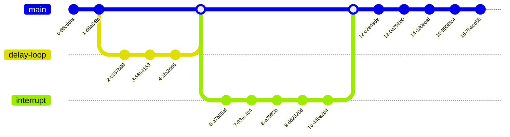

# Project 1 git workflow

For project 1, we'll follow a [feature branch workflow](https://www.atlassian.com/git/tutorials/comparing-workflows/feature-branch-workflow). We'll create two feature branches:

1. a `delay-loop` branch to implement the delay-loop-based heartbeat LED
2. an `interrupt` branch to implement the interrupt-based heartbeat LED

The git graph will look something like this, assuming you implement the delay loop method first:



Since you may need to fine-tune the timing of delay-loop and interrupt methods after merging the branches (using pull requests), it will be okay to commit those changes directly to main after merging both branches.

Additionally, you can commit your project presentation and final documentation directly to the main branch at the end. You can also commit the flowcharts at the very beginning or at the beginning of each branch.

## File organization

For this project, I'm suggesting the following directory structure:

- 📁 **`docs`**: documentation and presentations 
   - 📁 **`assets`**: images and other assets for documentation and presentations
- 📁 **`app`**: the CCS project

Please put your documentation (flowcharts, screenshots) and presentation in the `docs` folder.

## Procedure

1. **In a terminal, navigate to the directory you want to clone the repository inside of**
2. **Clone the repository** (copy the clone URL from your repository's main page):
    ```
    git clone git@github.com:msu-eele-465/project1-<username>.git
    ```
3. **Navigate to your repository**:
    ```
    cd project1-<username>
    ```
4. **Create the `delay-loop` branch**:
    ```
    git switch -c delay-loop 
    ```
5. **Do your development work** and make *atomic commits*[^1] along the way 🙂:
    ```
    git add 
    git commit 
    git push 
    repeat
    ```
> [!NOTE]
> *when pushing your new branch for the first time*, you need to tell git to create that branch on the remote repository:
> ```
> git push --set-upstream origin delay-loop 
> ```
6. When you’re done, **[create a pull request](https://docs.github.com/en/pull-requests/collaborating-with-pull-requests/proposing-changes-to-your-work-with-pull-requests/creating-a-pull-request)** from `delay-loop` into `main`.
7. **Merge the pull request online**. We're using pull requests so it is easy for the instructor and your partner to view the changes and do code reviews; the instructor will not be approving your pull requests.
8. **Pull the changes from the merge request into `main`**:
    ```
    git switch main
    git pull
    ```
9. **Create the `interrupt` branch**:
    ```
    git switch -c interrupt 
    ```
10. **Do your development work**:
    ```
    git add 
    git commit 
    git push 
    repeat
    ```
> [!TIP]
> Remember to use `--set-upstream origin interrupt` when pushing your new branch for the first time.
> ```
> git push --set-upstream origin interrupt
> ```
11. When you’re done, **[create a pull request](https://docs.github.com/en/pull-requests/collaborating-with-pull-requests/proposing-changes-to-your-work-with-pull-requests/creating-a-pull-request)** from `interrupt` into `main`.
12. **Merge the pull request online**. 
13. **Pull the changes from the merge request into `main`**:
    ```
    git switch main
    git pull
    ```
14. **Commit your presentation and final documentation (flowcharts)**
15. **Celebrate!** 🎉

[^1]: Working with atomic git commits means your commits are of the smallest possible size. 
Each commit does one, and only one simple thing, that can be summed up in a simple sentence. The amount of code change doesn't matter.
Writing atomic commits forces you to you make small, manageable changes as you tackle large tasks.

## Resources

Please refer to any of the git resources I've put on Brightspace or linked in the [intro to git presentation](https://msu-eele-465.github.io/intro-to-git/). There are so many git resources, tutorials, and videos out there; I'm sure you'll find something that helps and makes sense for you.
